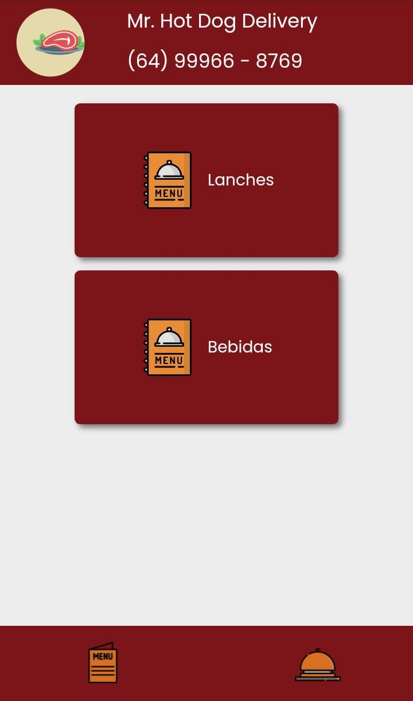
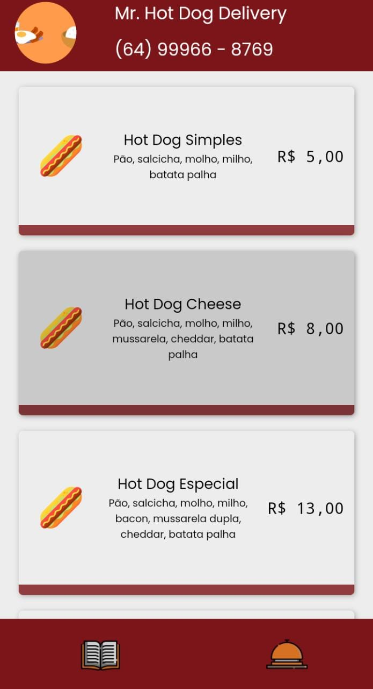

# cardapio-digital

<h1 align="center">
  
  
  
</h1>

 

## 🚀 Tecnologias, Hooks e Bibliotecas

Projeto desenvolvido com as seguintes tecnologias:

- ReactJS
- TypeScript
- useState (hook que armazena dados que podem variar com o tempo, qualquer informação ou dado deve ser armazenado no useState, só assim será possível renderizar a informação para o frontend web ou mobile)
- useEfect (hook utilizado para controlar a execução de uma função a partir da alteração de um determinado parâmetro)
- Styled Components (biblioteca que permite escrever códigos CSS dentro do Javascript)

## 💻 Projeto

A fim de revolucionar a forma de fazer seus pedidos naquele delivery onde demoram pra te mandar o cardápio, e você ainda tem que digitar um super texto para enviar.
Nosso projeto veio para ripar esse processo chato e burocrático, esperamos que aproveite o melhor do nosso esforço, trabalho e dedicação.

---

Por Thyerre Rangel, João Paulo França e Murilo Lopes